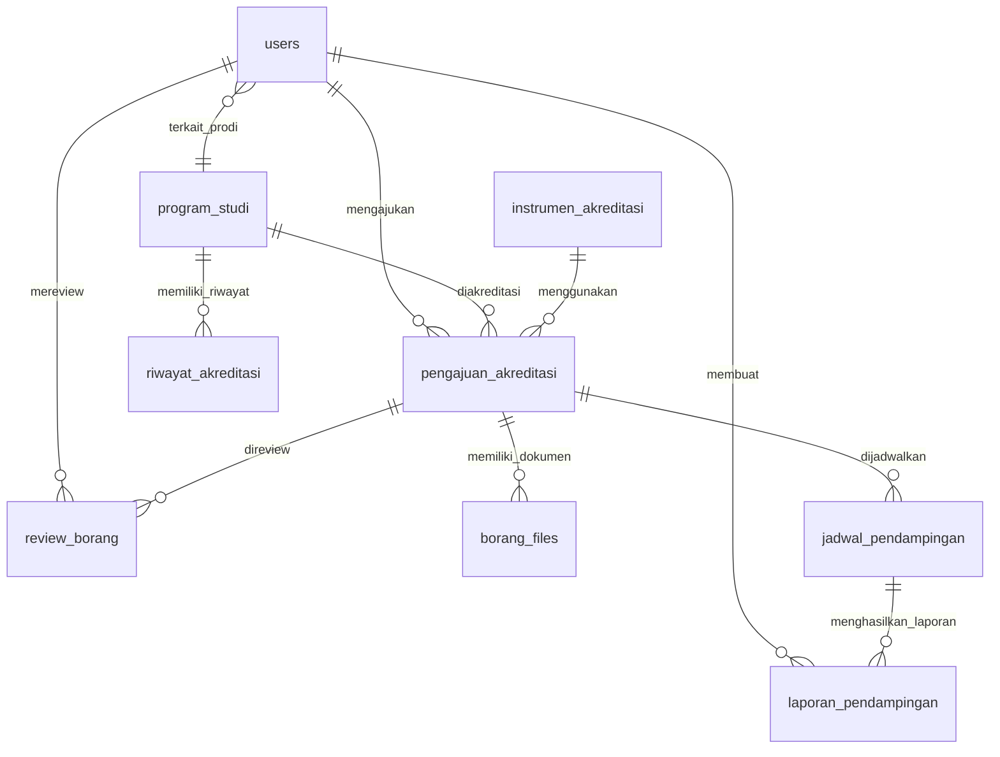

# Tahap 1: Perancangan Database MySQL & Skema Relasi — SIM Akreditasi

## Ringkasan

Membangun fondasi database `akreditasiflow_db` untuk Sistem Manajemen Akreditasi Perguruan Tinggi dengan skema relasi lengkap, foreign key, indexing, dan data seeder awal.

## Arsitektur Database

### Entity Relationship Diagram



---

## Desain Tabel

### 1. `users` — Pengguna Sistem (7 Roles RBAC)

| Kolom | Tipe | Keterangan |
|-------|------|-----------|
| `id` | INT, PK, AI | ID unik |
| `nip` | VARCHAR(30), UNIQUE | Nomor Induk Pegawai |
| `nama_lengkap` | VARCHAR(150) | Nama lengkap pengguna |
| `email` | VARCHAR(150), UNIQUE | Email unik |
| `password` | VARCHAR(255) | Hash password (bcrypt) |
| `role` | ENUM(7 roles) | Peran pengguna dalam RBAC |
| `program_studi_id` | INT, FK NULLABLE | Relasi ke prodi (untuk Admin Prodi & Task Force) |
| `jabatan` | VARCHAR(100) | Jabatan fungsional |
| `no_telepon` | VARCHAR(20) | Nomor telepon |
| `foto_profil` | VARCHAR(255) | Path foto profil |
| `is_active` | TINYINT(1) DEFAULT 1 | Status aktif |
| `last_login` | DATETIME | Waktu login terakhir |
| `created_at` / `updated_at` | TIMESTAMP | Audit trail |

**7 Roles RBAC:**
1. `admin_universitas` — Super admin, kelola seluruh sistem
2. `kepala_kpma` — Kepala Kantor Penjaminan Mutu Akademik
3. `kabid_kpma` — Kepala Bidang KPMA
4. `reviewer_internal` — Reviewer dokumen borang
5. `asesor_internal` — Asesor penilaian akreditasi
6. `admin_prodi` — Administrator tingkat Program Studi
7. `team_task_force` — Tim pelaksana tugas akreditasi

---

### 2. `program_studi` — Data Program Studi

| Kolom | Tipe | Keterangan |
|-------|------|-----------|
| `id` | INT, PK, AI | ID unik |
| `kode_prodi` | VARCHAR(20), UNIQUE | Kode resmi prodi |
| `nama_prodi` | VARCHAR(150) | Nama program studi |
| `jenjang` | ENUM('D3','D4','S1','S2','S3') | Jenjang pendidikan |
| `fakultas` | VARCHAR(150) | Nama fakultas |
| `akreditasi_terakhir` | VARCHAR(5) | Nilai akreditasi terakhir (A/B/C/Unggul/BaikSekali/Baik) |
| `tanggal_kadaluarsa` | DATE | Tanggal kadaluarsa akreditasi |
| `sk_akreditasi` | VARCHAR(100) | Nomor SK akreditasi |
| `kaprodi` | VARCHAR(150) | Nama Ketua Program Studi |
| `no_telepon_prodi` | VARCHAR(20) | Kontak prodi |
| `email_prodi` | VARCHAR(150) | Email prodi |
| `is_active` | TINYINT(1) DEFAULT 1 | Status aktif |
| `created_at` / `updated_at` | TIMESTAMP | Audit trail |

---

### 3. `instrumen_akreditasi` — Instrumen/Standar Akreditasi

| Kolom | Tipe | Keterangan |
|-------|------|-----------|
| `id` | INT, PK, AI | ID unik |
| `kode_instrumen` | VARCHAR(30), UNIQUE | Kode instrumen |
| `nama_instrumen` | VARCHAR(200) | Nama instrumen (misal: IAPS 4.0, 9 Kriteria) |
| `versi` | VARCHAR(20) | Versi instrumen |
| `lembaga_akreditasi` | VARCHAR(150) | Lembaga (BAN-PT, LAM, dll) |
| `deskripsi` | TEXT | Deskripsi instrumen |
| `jumlah_standar` | INT | Jumlah standar/kriteria |
| `is_active` | TINYINT(1) DEFAULT 1 | Status aktif |
| `created_at` / `updated_at` | TIMESTAMP | Audit trail |

---

### 4. `pengajuan_akreditasi` — Pengajuan Proses Akreditasi

| Kolom | Tipe | Keterangan |
|-------|------|-----------|
| `id` | INT, PK, AI | ID unik |
| `program_studi_id` | INT, FK | Relasi ke prodi |
| `instrumen_akreditasi_id` | INT, FK | Relasi ke instrumen |
| `user_pengaju_id` | INT, FK | User yang mengajukan |
| `nomor_pengajuan` | VARCHAR(50), UNIQUE | Nomor unik pengajuan |
| `jenis_pengajuan` | ENUM('akreditasi_baru','reakreditasi','perpanjangan') | Jenis pengajuan |
| `tanggal_pengajuan` | DATE | Tanggal pengajuan |
| `tanggal_target` | DATE | Target selesai |
| `status` | ENUM('draft','diajukan','review','revisi','disetujui','ditolak','selesai') | Status workflow |
| `catatan` | TEXT | Catatan pengajuan |
| `approved_by` | INT, FK NULLABLE | User yang menyetujui |
| `approved_at` | DATETIME | Waktu persetujuan |
| `created_at` / `updated_at` | TIMESTAMP | Audit trail |

---

### 5. `borang_files` — Dokumen Borang Akreditasi

| Kolom | Tipe | Keterangan |
|-------|------|-----------|
| `id` | INT, PK, AI | ID unik |
| `pengajuan_akreditasi_id` | INT, FK | Relasi ke pengajuan |
| `uploaded_by` | INT, FK | User yang mengupload |
| `nama_dokumen` | VARCHAR(200) | Nama dokumen |
| `kategori_dokumen` | ENUM('led','lkps','dokumen_pendukung','surat_pengantar','sk_penetapan','bukti_kinerja') | Kategori |
| `nomor_standar` | VARCHAR(10) | Nomor standar/kriteria terkait |
| `file_path` | VARCHAR(500) | Path file di server |
| `file_name` | VARCHAR(255) | Nama file asli |
| `file_size` | BIGINT | Ukuran file (bytes) |
| `file_type` | VARCHAR(50) | MIME type |
| `versi_dokumen` | INT DEFAULT 1 | Versi dokumen |
| `status` | ENUM('uploaded','verified','rejected','revised') | Status verifikasi |
| `catatan_verifikasi` | TEXT | Catatan dari reviewer |
| `verified_by` | INT, FK NULLABLE | User yang memverifikasi |
| `verified_at` | DATETIME | Waktu verifikasi |
| `created_at` / `updated_at` | TIMESTAMP | Audit trail |

---

### 6. `review_borang` — Review Dokumen Borang

| Kolom | Tipe | Keterangan |
|-------|------|-----------|
| `id` | INT, PK, AI | ID unik |
| `pengajuan_akreditasi_id` | INT, FK | Relasi ke pengajuan |
| `reviewer_id` | INT, FK | User reviewer |
| `borang_file_id` | INT, FK NULLABLE | Dokumen spesifik yang di-review |
| `jenis_review` | ENUM('desk_evaluation','visitasi','review_dokumen','review_substansi') | Jenis review |
| `skor_penilaian` | DECIMAL(5,2) | Skor penilaian (0-100 atau 0-4) |
| `catatan_review` | TEXT | Catatan/feedback review |
| `rekomendasi` | ENUM('layak','perlu_revisi','tidak_layak') | Rekomendasi |
| `status_review` | ENUM('pending','in_progress','completed') | Status review |
| `tanggal_review` | DATE | Tanggal review dilakukan |
| `created_at` / `updated_at` | TIMESTAMP | Audit trail |

---

### 7. `jadwal_pendampingan` — Jadwal Kegiatan Pendampingan

| Kolom | Tipe | Keterangan |
|-------|------|-----------|
| `id` | INT, PK, AI | ID unik |
| `pengajuan_akreditasi_id` | INT, FK | Relasi ke pengajuan |
| `judul_kegiatan` | VARCHAR(200) | Judul kegiatan |
| `jenis_kegiatan` | ENUM('workshop','bimtek','pendampingan','simulasi','asesmen') | Jenis kegiatan |
| `tanggal_mulai` | DATETIME | Waktu mulai |
| `tanggal_selesai` | DATETIME | Waktu selesai |
| `lokasi` | VARCHAR(200) | Lokasi kegiatan |
| `deskripsi` | TEXT | Deskripsi kegiatan |
| `penanggung_jawab_id` | INT, FK | User penanggung jawab |
| `status` | ENUM('dijadwalkan','berlangsung','selesai','dibatalkan') | Status kegiatan |
| `created_at` / `updated_at` | TIMESTAMP | Audit trail |

---

### 8. `riwayat_akreditasi` — Riwayat Hasil Akreditasi

| Kolom | Tipe | Keterangan |
|-------|------|-----------|
| `id` | INT, PK, AI | ID unik |
| `program_studi_id` | INT, FK | Relasi ke prodi |
| `pengajuan_akreditasi_id` | INT, FK NULLABLE | Relasi ke pengajuan (jika ada) |
| `lembaga_akreditasi` | VARCHAR(150) | Lembaga yang mengeluarkan |
| `nomor_sk` | VARCHAR(100) | Nomor SK hasil |
| `tanggal_sk` | DATE | Tanggal SK |
| `masa_berlaku_mulai` | DATE | Masa berlaku mulai |
| `masa_berlaku_selesai` | DATE | Masa berlaku selesai |
| `nilai_akreditasi` | VARCHAR(20) | Hasil (A/B/C/Unggul/Baik Sekali/Baik) |
| `skor_akhir` | DECIMAL(5,2) | Skor numerik |
| `dokumen_sk_path` | VARCHAR(500) | Path file SK |
| `catatan` | TEXT | Catatan tambahan |
| `created_at` / `updated_at` | TIMESTAMP | Audit trail |

---

### 9. `laporan_pendampingan` — Laporan Kegiatan Pendampingan

| Kolom | Tipe | Keterangan |
|-------|------|-----------|
| `id` | INT, PK, AI | ID unik |
| `jadwal_pendampingan_id` | INT, FK | Relasi ke jadwal |
| `user_pelapor_id` | INT, FK | User yang membuat laporan |
| `judul_laporan` | VARCHAR(200) | Judul laporan |
| `isi_laporan` | TEXT | Isi laporan |
| `hasil_kegiatan` | TEXT | Hasil/outcome kegiatan |
| `tindak_lanjut` | TEXT | Rencana tindak lanjut |
| `file_lampiran` | VARCHAR(500) | Path file lampiran |
| `status` | ENUM('draft','submitted','approved','rejected') | Status laporan |
| `approved_by` | INT, FK NULLABLE | User yang menyetujui |
| `approved_at` | DATETIME | Waktu persetujuan |
| `created_at` / `updated_at` | TIMESTAMP | Audit trail |

---

### 10. `notifikasi` — Sistem Notifikasi (Tabel Tambahan)

| Kolom | Tipe | Keterangan |
|-------|------|-----------|
| `id` | INT, PK, AI | ID unik |
| `user_id` | INT, FK | Penerima notifikasi |
| `judul` | VARCHAR(200) | Judul notifikasi |
| `pesan` | TEXT | Isi notifikasi |
| `tipe` | ENUM('info','warning','success','danger') | Tipe notifikasi |
| `link` | VARCHAR(500) | URL terkait |
| `is_read` | TINYINT(1) DEFAULT 0 | Status baca |
| `created_at` | TIMESTAMP | Waktu dibuat |

---

### 11. `activity_log` — Log Aktivitas Sistem (Tabel Tambahan)

| Kolom | Tipe | Keterangan |
|-------|------|-----------|
| `id` | BIGINT, PK, AI | ID unik |
| `user_id` | INT, FK | User pelaku |
| `aktivitas` | VARCHAR(200) | Deskripsi aktivitas |
| `modul` | VARCHAR(100) | Modul terkait |
| `detail` | TEXT | Detail JSON |
| `ip_address` | VARCHAR(45) | IP address |
| `user_agent` | VARCHAR(500) | Browser user agent |
| `created_at` | TIMESTAMP | Waktu aktivitas |

> [!NOTE]
> Tabel `notifikasi` dan `activity_log` ditambahkan sebagai pendukung RBAC dan audit trail yang sangat penting untuk sistem akreditasi. Kedua tabel ini akan sangat berguna pada tahap pengembangan selanjutnya.

---

## Strategi Indexing

| Tabel | Index | Kolom | Alasan |
|-------|-------|-------|--------|
| `users` | UNIQUE | `nip`, `email` | Pencarian login & identifikasi |
| `users` | INDEX | `role`, `program_studi_id` | Filter berdasarkan role & prodi |
| `program_studi` | UNIQUE | `kode_prodi` | Pencarian prodi |
| `program_studi` | INDEX | `fakultas` | Filter per fakultas |
| `pengajuan_akreditasi` | INDEX | `status`, `program_studi_id` | Filter workflow |
| `pengajuan_akreditasi` | UNIQUE | `nomor_pengajuan` | Pencarian unik |
| `borang_files` | INDEX | `pengajuan_akreditasi_id`, `kategori_dokumen` | Listing dokumen |
| `review_borang` | INDEX | `pengajuan_akreditasi_id`, `reviewer_id` | Pencarian review |
| `jadwal_pendampingan` | INDEX | `tanggal_mulai`, `status` | Kalender kegiatan |
| `riwayat_akreditasi` | INDEX | `program_studi_id` | Riwayat per prodi |

---

## Data Seeder

Data seeder akan mencakup:

1. **Users (14 akun)** — 2 akun per role untuk pengujian
2. **Program Studi (6 prodi)** — Beragam jenjang & fakultas
3. **Instrumen Akreditasi (3 instrumen)** — IAPS 4.0, 9 Kriteria, LAM
4. **Pengajuan Akreditasi (4 pengajuan)** — Berbagai status workflow
5. **Borang Files (8 dokumen)** — Contoh dokumen per pengajuan
6. **Review Borang (4 review)** — Contoh review dalam berbagai status
7. **Jadwal Pendampingan (4 jadwal)** — Contoh kegiatan pendampingan
8. **Riwayat Akreditasi (6 riwayat)** — Riwayat per prodi
9. **Laporan Pendampingan (2 laporan)** — Contoh laporan

> [!IMPORTANT]
> Semua password seeder menggunakan hash bcrypt dari `password123` untuk kemudahan testing.

---

## File yang Akan Dibuat

### [NEW] [akreditasiflow_db.sql](file:///c:/xampp/htdocs/SimAkreditasi/database/akreditasiflow_db.sql)
File SQL DDL lengkap berisi CREATE DATABASE, CREATE TABLE, dan constraint definitions.

### [NEW] [seeder.sql](file:///c:/xampp/htdocs/SimAkreditasi/database/seeder.sql)
File SQL berisi INSERT statements untuk data awal pengujian.

### [NEW] [README.md](file:///c:/xampp/htdocs/SimAkreditasi/README.md)
Dokumentasi proyek yang diperbarui dengan instruksi setup database.

---

## Verification Plan

### Automated Tests
```bash
# Import DDL ke MySQL
mysql -u root < c:\xampp\htdocs\SimAkreditasi\database\akreditasiflow_db.sql

# Import Seeder
mysql -u root < c:\xampp\htdocs\SimAkreditasi\database\seeder.sql

# Verifikasi tabel terbuat
mysql -u root -e "USE akreditasiflow_db; SHOW TABLES;"

# Verifikasi relasi FK
mysql -u root -e "USE akreditasiflow_db; SELECT TABLE_NAME, CONSTRAINT_NAME, REFERENCED_TABLE_NAME FROM information_schema.KEY_COLUMN_USAGE WHERE TABLE_SCHEMA='akreditasiflow_db' AND REFERENCED_TABLE_NAME IS NOT NULL;"
```

### Manual Verification
- Pastikan semua 11 tabel terbuat dengan benar
- Verifikasi foreign key constraints berfungsi (coba insert data yang melanggar FK)
- Pastikan seeder data bisa di-import tanpa error
- Cek indexing terpasang dengan `SHOW INDEX FROM [table]`
