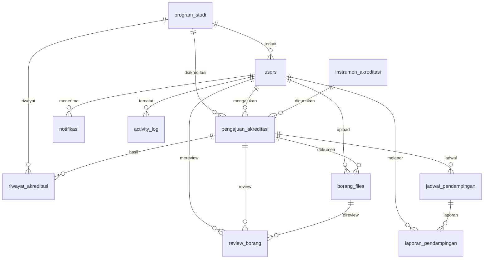

# Walkthrough — Tahap 1: Database MySQL & Skema Relasi

## Ringkasan

Tahap 1 berhasil diselesaikan. Database `akreditasiflow_db` telah dibuat dengan **11 tabel**, **20 foreign key constraints**, **30+ indexes**, dan **65 records** data seeder untuk pengujian.

## File yang Dibuat

| File | Deskripsi |
|------|-----------|
| [akreditasiflow_db.sql](file:///c:/xampp/htdocs/SimAkreditasi/database/akreditasiflow_db.sql) | DDL lengkap — CREATE DATABASE, 11 tabel, FK, indexes |
| [seeder.sql](file:///c:/xampp/htdocs/SimAkreditasi/database/seeder.sql) | Data seeder — 65 records untuk pengujian |
| [README.md](file:///c:/xampp/htdocs/SimAkreditasi/README.md) | Dokumentasi proyek dengan instruksi setup |

## Struktur Database

## Tabel & Jumlah Data

| No | Tabel | Records | Keterangan |
|----|-------|---------|-----------|
| 1 | `program_studi` | 6 | 3 fakultas, beragam jenjang & akreditasi |
| 2 | `users` | 14 | 2 akun per role × 7 roles |
| 3 | `instrumen_akreditasi` | 3 | IAPS 4.0, IAPT 3.0, LAM Infokom |
| 4 | `pengajuan_akreditasi` | 4 | Status: draft, diajukan, review, disetujui |
| 5 | `borang_files` | 8 | LED, LKPS, SK, bukti kinerja |
| 6 | `review_borang` | 4 | Desk evaluation, review dokumen/substansi |
| 7 | `jadwal_pendampingan` | 4 | Workshop, bimtek, simulasi, pendampingan |
| 8 | `riwayat_akreditasi` | 6 | Riwayat per prodi |
| 9 | `laporan_pendampingan` | 2 | Laporan kegiatan selesai |
| 10 | `notifikasi` | 8 | Berbagai tipe & status |
| 11 | `activity_log` | 10 | Log aktivitas beragam |
| | **TOTAL** | **65** | |

## Foreign Key Constraints (20 FK)

| Tabel | FK → Referensi | ON DELETE |
|-------|---------------|-----------|
| `users` | `program_studi_id` → `program_studi.id` | SET NULL |
| `pengajuan_akreditasi` | `program_studi_id` → `program_studi.id` | RESTRICT |
| `pengajuan_akreditasi` | `instrumen_akreditasi_id` → `instrumen_akreditasi.id` | RESTRICT |
| `pengajuan_akreditasi` | `user_pengaju_id` → `users.id` | RESTRICT |
| `pengajuan_akreditasi` | `approved_by` → `users.id` | SET NULL |
| `borang_files` | `pengajuan_akreditasi_id` → `pengajuan_akreditasi.id` | CASCADE |
| `borang_files` | `uploaded_by` → `users.id` | RESTRICT |
| `borang_files` | `verified_by` → `users.id` | SET NULL |
| `review_borang` | `pengajuan_akreditasi_id` → `pengajuan_akreditasi.id` | CASCADE |
| `review_borang` | `reviewer_id` → `users.id` | RESTRICT |
| `review_borang` | `borang_file_id` → `borang_files.id` | SET NULL |
| `jadwal_pendampingan` | `pengajuan_akreditasi_id` → `pengajuan_akreditasi.id` | CASCADE |
| `jadwal_pendampingan` | `penanggung_jawab_id` → `users.id` | RESTRICT |
| `riwayat_akreditasi` | `program_studi_id` → `program_studi.id` | RESTRICT |
| `riwayat_akreditasi` | `pengajuan_akreditasi_id` → `pengajuan_akreditasi.id` | SET NULL |
| `laporan_pendampingan` | `jadwal_pendampingan_id` → `jadwal_pendampingan.id` | CASCADE |
| `laporan_pendampingan` | `user_pelapor_id` → `users.id` | RESTRICT |
| `laporan_pendampingan` | `approved_by` → `users.id` | SET NULL |
| `notifikasi` | `user_id` → `users.id` | CASCADE |
| `activity_log` | `user_id` → `users.id` | SET NULL |

## Verifikasi

| Test | Status |
|------|--------|
| DDL import tanpa error | ✅ Pass |
| Seeder import tanpa error | ✅ Pass |
| 11 tabel terbuat | ✅ Pass |
| 20 FK constraints aktif | ✅ Pass |
| 65 records tersimpan | ✅ Pass |
| 7 roles RBAC (2 akun/role) | ✅ Pass |

## Siap untuk Tahap 2

Database foundation sudah solid. Tahap selanjutnya: **Arsitektur MVC & Konfigurasi Dasar** — membangun folder structure, routing, autoloader, dan konfigurasi koneksi database.
